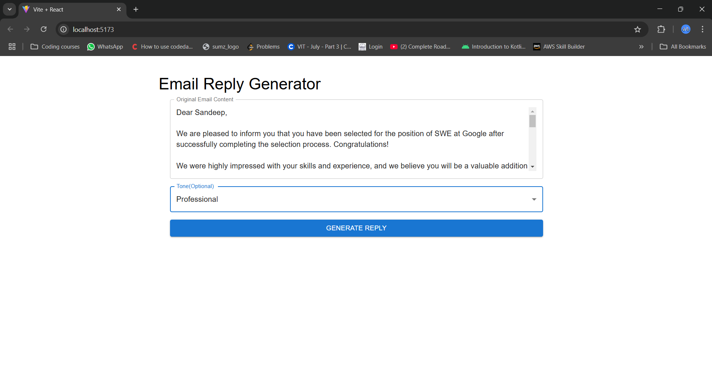
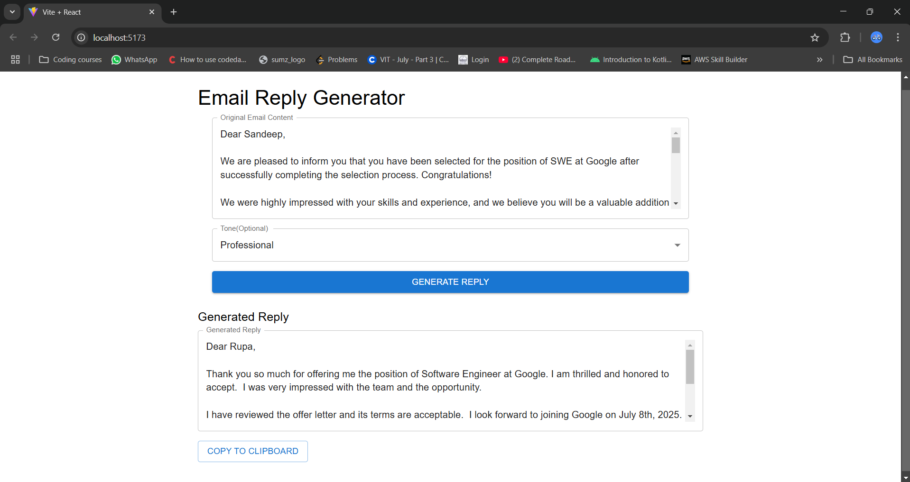
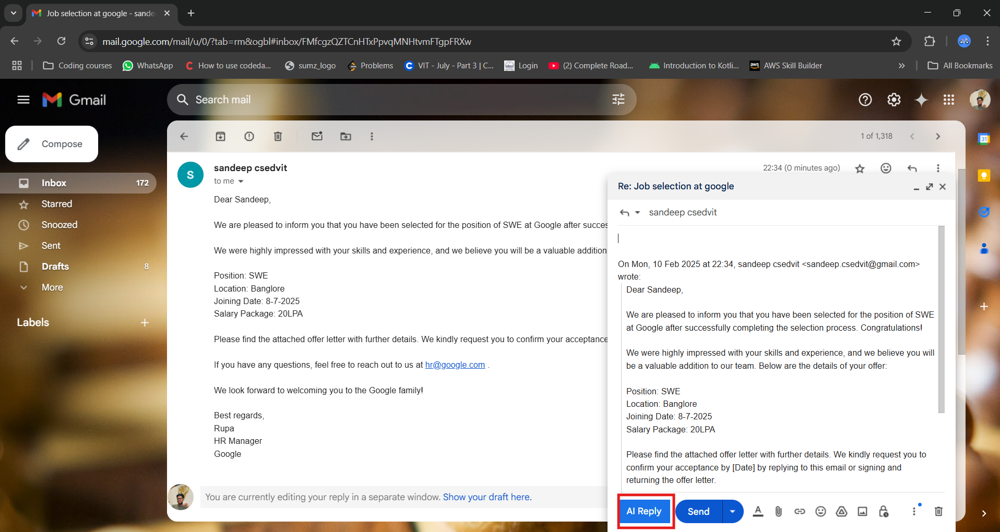
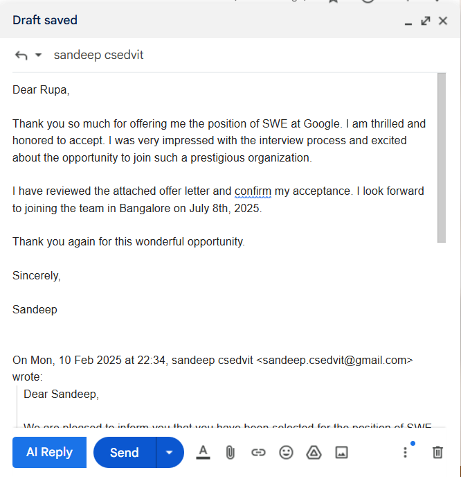

# 📧🪄 MailWizard

🚀 **MailWizard** is an AI-powered browser extension designed to help users generate email responses effortlessly. By selecting a preferred tone, users can quickly craft context-aware replies, enhancing productivity and streamlining email communication.

---

## ✨ Key Features

- **AI-Powered Replies** – Generates intelligent responses based on email context.
- **Tone Selection** – Choose from multiple tones (Formal, Friendly, Professional, etc.).
- **Seamless Gmail Integration** – Works directly within Gmail for a smooth experience.
- **One-Click Reply** – Instantly insert AI-generated responses with a single click.
- **Customizable Suggestions** – Edit and refine responses before sending.

---

## 🛠 Installation Guide

1. Clone this repository:
   ```bash
   git clone https://github.com/yourusername/gmail-reply-helper.git
   ```
2. Open Chrome and navigate to chrome://extensions/.
3. Enable Developer mode (top right corner).
4. Click **Load unpacked** and select the cloned project folder (email-writer-extension).
5. The extension will now be available in your browser.

---

## ⚙️ How to Use

1. Front-End to generate the reply to the email

   

2. Reply Generated From Backend

   

3. Use Extension injected Gmail Page

   

4. Reply Generated by AI to the email extension

   

---

## 📦 Technologies Used

1. 
2. 
3. 
4. 
5. 
6. 

---

## 🛡 Security & Privacy

1. **No email storage** – Your emails are never stored or accessed by the extension.
2. **Real-time AI responses** – AI-generated responses are created in real-time without saving any user data.

---

## 🚀 Roadmap

1. ✅ Support for multiple tones
2. ✅ Seamless integration with Gmail
3. 🔜 Advanced AI-powered personalization options
4. 🔜 Support for additional email platforms

---

## 🤝 Contributing

We welcome contributions! Feel free to fork this repository, make changes, and submit pull requests.
