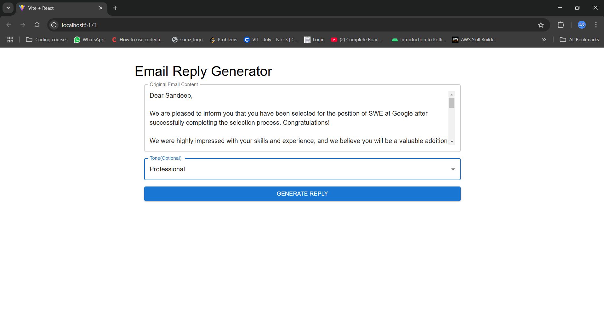
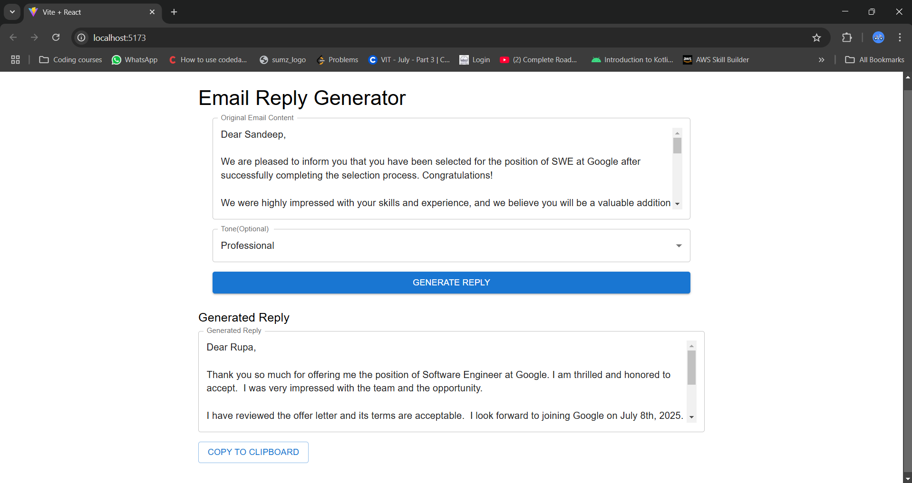
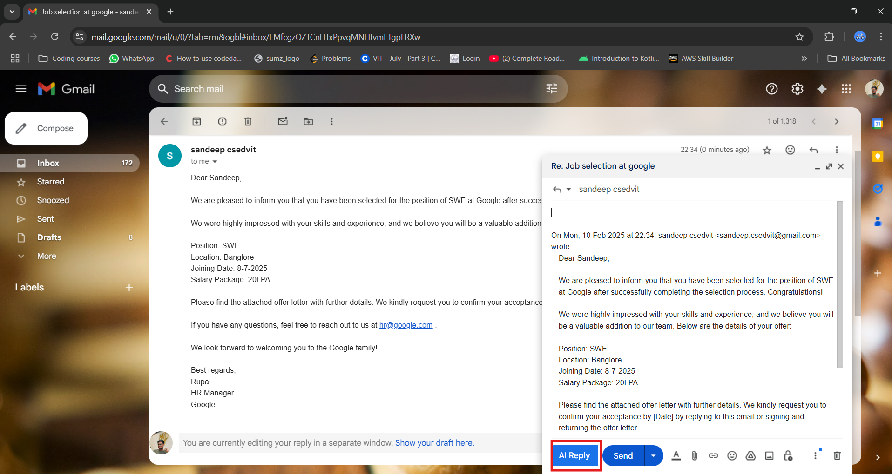
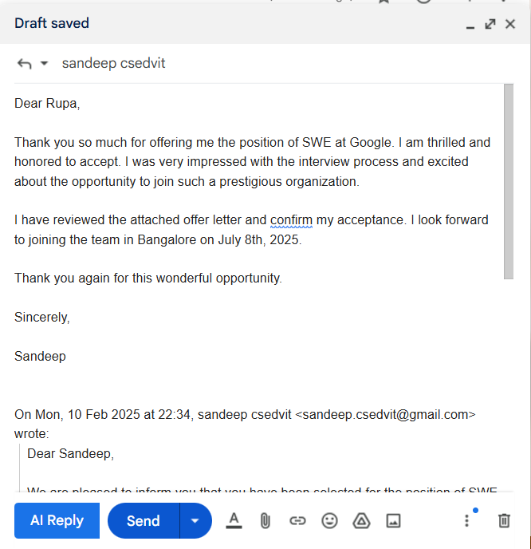

<div align="center">

# MailWizard

**AI-Powered Email Reply Generator — Browser Extension + Spring Boot Backend + React Dashboard**

[](https://spring.io/projects/spring-boot)
[](https://openjdk.org/)
[](https://react.dev/)
[](https://vitejs.dev/)
[](https://ai.google.dev/)
[](https://developer.chrome.com/docs/extensions/)

[Features](#key-features) · [Architecture](#system-architecture) · [Getting Started](#running-locally) · [API Reference](#api-reference) · [Contributing](#contributing)

</div>

---

## Table of Contents

- [Project Overview](#project-overview)
- [Why This Project Exists](#why-this-project-exists)
- [What Makes This Project Technically Interesting](#what-makes-this-project-technically-interesting)
- [Key Features](#key-features)
- [System Architecture](#system-architecture)
- [End-to-End Flow](#end-to-end-flow)
- [Dashboard Walkthrough](#dashboard-walkthrough)
- [API Reference](#api-reference)
- [Folder Structure](#folder-structure)
- [Running Locally](#running-locally)
- [Running Tests](#running-tests)
- [Production-Grade Improvements](#production-grade-improvements)
- [Real-World Constraints and Limitations](#real-world-constraints-and-limitations)
- [Security Considerations](#security-considerations)
- [Future Enhancements](#future-enhancements)
- [License](#license)

---

## Project Overview

**MailWizard** is a full-stack, AI-driven email reply generation system composed of three decoupled components that work together to deliver context-aware email responses directly inside Gmail:

| Component | Role | Stack |
|---|---|---|
| **Chrome Extension** | DOM injection layer — detects the Gmail compose window, extracts email content, and inserts AI-generated replies into the editor | Vanilla JS, Chrome Manifest V3 |
| **Spring Boot Backend** | API server — receives email content + tone, constructs a prompt, calls the Google Gemini API, parses the response, and returns the generated reply | Spring Boot 3.4, Java 23, WebFlux, Lombok |
| **React Front-End** | Standalone dashboard — provides a UI for pasting email content, selecting a tone, and copying the generated reply | React 19, MUI 6, Vite 6, Axios |

The system is designed around a **stateless, prompt-driven architecture** — no email data is persisted anywhere. Each request is processed in real-time and discarded immediately after the response is returned.

---

## Why This Project Exists

Writing email replies is a repetitive, time-consuming task — especially in professional environments where tone, formality, and clarity matter. Existing solutions either lock you into a specific email client, require full mailbox access, or operate as opaque SaaS products with privacy concerns.

MailWizard takes a different approach:

- **Zero data persistence** — emails are never stored, logged, or cached. The AI processes them in real-time and the pipeline holds no state between requests.
- **In-place generation** — the Chrome extension injects the reply directly into the Gmail compose editor, eliminating copy-paste friction.
- **Tone-aware prompting** — the backend constructs a context-sensitive prompt that instructs the LLM to match the user's desired tone (professional, casual, friendly), producing replies that feel natural rather than generic.
- **Decoupled architecture** — the extension, API server, and dashboard are fully independent. Any component can be replaced, scaled, or extended without affecting the others.

---

## What Makes This Project Technically Interesting

### 1. DOM Mutation Observation for Dynamic UI Injection

Gmail is a Single Page Application that dynamically renders compose windows without full page reloads. The extension uses a `MutationObserver` on `document.body` with `childList: true` and `subtree: true` to detect when the compose dialog is appended to the DOM. This is the correct approach for SPAs — polling or `DOMContentLoaded` events would miss dynamically injected elements.

### 2. Resilient CSS Selector Strategy

Gmail's DOM structure is obfuscated and subject to change. The extension uses a **fallback selector chain** — an array of candidate selectors is iterated until a match is found. This provides resilience against Google's DOM refactors:

```javascript
const selectors = ['.h7', '.a3s.aiL', '.gmail_quote', '[role="presentation"]'];
```

The same pattern is used for toolbar detection and compose box identification.

### 3. Non-Blocking LLM Integration via WebFlux

The backend uses Spring WebFlux's `WebClient` (not `RestTemplate`) to call the Gemini API. Although the current implementation uses `.block()` for simplicity, the reactive foundation means the service can be upgraded to return `Mono<String>` for fully non-blocking, event-driven request handling — critical for production throughput under concurrent load.

### 4. Prompt Engineering with Conditional Tone Injection

The `buildPrompt()` method doesn't blindly append the tone — it conditionally injects it only when provided, producing a cleaner prompt when tone is unspecified. The prompt explicitly instructs the model to omit subject lines, preventing the LLM from generating redundant headers.

### 5. Gemini API Response Parsing with Jackson Tree Model

The `extractResponseContent()` method navigates the Gemini API's nested JSON response structure (`candidates[0].content.parts[0].text`) using Jackson's `JsonNode` tree model with `.path()` for null-safe traversal. This is more robust than direct `get()` calls, which throw on missing nodes.

### 6. Chrome Manifest V3 Compliance

The extension targets Manifest V3 — the current Chrome extension standard. It uses `host_permissions` for origin-level access control and `web_accessible_resources` with match patterns, both of which are V3-specific constructs. The `activeTab` and `storage` permissions follow the principle of least privilege.

---

## Key Features

- **AI-Powered Context-Aware Replies** — The Gemini LLM processes the full email content and generates a reply that directly addresses the sender's points, not a generic acknowledgment.
- **Tone Selection** — Choose from Professional, Casual, or Friendly tones. The tone is injected into the prompt, guiding the model's output style without hard-coding response templates.
- **In-Gmail One-Click Reply** — The Chrome extension injects an "AI Reply" button directly into Gmail's compose toolbar. Clicking it extracts the email, calls the backend, and inserts the reply — all without leaving Gmail.
- **Standalone Dashboard** — A React-based web UI provides the same functionality outside of Gmail, useful for drafting replies from other email clients or mobile devices.
- **Clipboard Integration** — The dashboard includes a one-click "Copy to Clipboard" button for the generated reply.
- **Zero Data Retention** — No database, no session storage, no logging of email content. The pipeline is stateless by design.
- **CORS-Enabled API** — The backend exposes `@CrossOrigin(origins = "*")`, allowing any front-end client to consume the API during development.

---

## System Architecture

```
┌─────────────────────────────────────────────────────────────────────────────┐
│                              SYSTEM ARCHITECTURE                            │
└─────────────────────────────────────────────────────────────────────────────┘

 ┌──────────────────┐       ┌──────────────────────┐       ┌───────────────┐
 │                  │       │                      │       │               │
 │  Gmail Web Page  │       │   Spring Boot API    │       │  Google Gemini│
 │  (mail.google)   │       │   (localhost:8080)    │       │  REST API     │
 │                  │       │                      │       │               │
 │ ┌──────────────┐ │       │ ┌──────────────────┐ │       │               │
 │ │  Content     │ │       │ │  EmailGenerator  │ │       │               │
 │ │  Script      │ │       │ │  Controller      │ │       │               │
 │ │  (content.js)│◄├──────►│ │  POST /generate  │ │       │               │
 │ │              │ │ HTTP  │ └────────┬─────────┘ │       │               │
 │ │  - Extract   │ │       │          │           │       │               │
 │ │    email text │ │       │ ┌────────▼─────────┐ │       │               │
 │ │  - Inject    │ │       │ │  EmailGenerator  │ │  HTTP │               │
 │ │    AI button │ │       │ │  Service         │◄├──────►│  Gemini LLM   │
 │ │  - Insert    │ │       │ │                  │ │  POST │               │
 │ │    reply     │ │       │ │  - Build prompt  │ │       │               │
 │ └──────────────┘ │       │ │  - Call Gemini   │ │       │               │
 │                  │       │ │  - Parse JSON    │ │       │               │
 └──────────────────┘       │ └──────────────────┘ │       └───────────────┘
                            │                      │
                            └──────────────────────┘
                                     ▲
                                     │ HTTP
                            ┌────────┴─────────┐
                            │                  │
                            │  React Dashboard │
                            │  (localhost:5173) │
                            │                  │
                            │  - Paste email   │
                            │  - Select tone   │
                            │  - Copy reply    │
                            └──────────────────┘
```

### Component Communication

```
┌──────────────────────────────────────────────────────────────────┐
│                     REQUEST / RESPONSE FLOW                      │
└──────────────────────────────────────────────────────────────────┘

  Client (Extension / Dashboard)          Spring Boot Backend
  ─────────────────────────────          ────────────────────

       ┌──────────┐                          ┌──────────┐
       │  Extract  │                          │  Receive │
       │  Email    │                          │  Request │
       │  Content  │                          └─────┬────┘
       └─────┬────┘                                │
             │                                     ▼
       ┌─────▼────┐                          ┌──────────┐
       │  Select  │                          │  Build   │
       │  Tone    │                          │  Prompt  │
       └─────┬────┘                          └─────┬────┘
             │                                     │
             │    POST /api/email/generate          ▼
             ├────────────────────────────────►┌──────────┐
             │  { emailContent, tone }        │  Call    │
             │                                │  Gemini  │
             │                                │  API     │
             │                          ┌─────┴────────┘
             │                          │
             │                          ▼
             │                          ┌──────────┐
             │                          │  Parse   │
             │                          │  JSON    │
             │                          │  Response│
             │                          └─────┬────┘
             │                                │
             │   200 OK  (plain text reply)   ▼
             ◄────────────────────────────────┤
             │                                │
       ┌─────▼────┐                          │
       │  Insert  │                          │
       │  Reply   │                          │
       │  in DOM  │                          │
       └──────────┘                          │
```

---

## End-to-End Flow

### Flow A: Chrome Extension (In-Gmail Experience)

```
 1. User opens Gmail and clicks "Compose" or "Reply"
         │
         ▼
 2. MutationObserver detects the compose dialog in the DOM
         │
         ▼
 3. Content script injects "AI Reply" button into Gmail's toolbar
    (using fallback selector chain: .btC → .aDh → [role="toolbar"] → .gU.Up)
         │
         ▼
 4. User clicks "AI Reply"
         │
         ▼
 5. Content script extracts email body text
    (fallback selectors: .h7 → .a3s.aiL → .gmail_quote → [role="presentation"])
         │
         ▼
 6. POST request sent to http://localhost:8080/api/email/generate
    Body: { "emailContent": "...", "tone": "professional" }
         │
         ▼
 7. Spring Boot receives request → builds prompt → calls Gemini API
         │
         ▼
 8. Gemini returns generated reply → backend parses JSON → returns plain text
         │
         ▼
 9. Content script locates compose textbox [role="textbox"][g_editable="true"]
    and inserts the reply via document.execCommand('insertText')
         │
         ▼
10. User reviews, edits if needed, and sends the email
```

### Flow B: React Dashboard (Standalone Web UI)

```
 1. User opens the React dashboard at localhost:5173
         │
         ▼
 2. Pastes the original email content into the text field
         │
         ▼
 3. Optionally selects a tone from the dropdown (Professional / Casual / Friendly)
         │
         ▼
 4. Clicks "Generate Reply"
         │
         ▼
 5. Axios POST to http://localhost:8080/api/email/generate
         │
         ▼
 6. Backend processes the request (same pipeline as Flow A, steps 7-8)
         │
         ▼
 7. Generated reply displayed in a read-only text field
         │
         ▼
 8. User clicks "Copy to Clipboard" to copy the reply
```

---

## Dashboard Walkthrough

The React front-end provides a clean, Material UI-driven interface for generating email replies outside of Gmail.

### Step 1 — Input the Original Email

Paste the email content you want to reply to into the multi-line text field.



### Step 2 — Generate the Reply

Select an optional tone and click "Generate Reply". The backend calls the Gemini API and returns a context-aware response.



### Step 3 — Use the Chrome Extension in Gmail

The extension injects an "AI Reply" button directly into Gmail's compose toolbar. Click it to generate a reply without leaving Gmail.



### Step 4 — AI Reply Inserted into Compose Editor

The generated reply is automatically inserted into the Gmail compose box. Review, edit, and send.



---

## API Reference

### `POST /api/email/generate`

Generates an AI-powered email reply based on the provided email content and tone.

#### Request

| Field | Type | Required | Description |
|---|---|---|---|
| `emailContent` | `string` | Yes | The original email text to generate a reply for |
| `tone` | `string` | No | Desired reply tone. Accepted values: `"professional"`, `"casual"`, `"friendly"`. Omit or pass empty string for default tone. |

#### Request Body Example

```json
{
  "emailContent": "Hi, I wanted to follow up on our meeting from last Friday. Are we still on track for the Q2 deliverables?",
  "tone": "professional"
}
```

#### Response

| Status | Body Type | Description |
|---|---|---|
| `200 OK` | `text/plain` | The generated email reply as plain text |
| `4xx / 5xx` | — | Error (malformed request, Gemini API failure, etc.) |

#### Response Example

```
Thank you for following up. Yes, we are on track for the Q2 deliverables as discussed in our meeting. I'll send a detailed status update by end of day tomorrow. Please let me know if you need anything else in the meantime.
```

#### Internal Pipeline

```
POST /api/email/generate
        │
        ▼
 EmailGeneratorController.generateEmail()
        │
        ▼
 EmailGeneratorService.generateEmailReply()
        │
        ├──► buildPrompt(emailRequest)
        │       Constructs: "Generate a professional email reply for the following
        │       email content. Please don't generate a Subject line. [Use a <tone> tone]
        │       Original email: <content>"
        │
        ├──► WebClient.post() → Gemini API
        │       URI: gemini.api.url + gemini.api.key
        │       Body: { "contents": [{ "parts": [{ "text": "<prompt>" }] }] }
        │
        └──► extractResponseContent(response)
                Parses: candidates[0].content.parts[0].text
                Returns: plain text reply
```

---

## Folder Structure

```
Email-AI-Assistance/
├── email-writer-extension/              # Chrome Extension (Manifest V3)
│   ├── manifest.json                    # Extension config — permissions, content scripts, host permissions
│   ├── content.js                       # Content script — DOM observation, email extraction, reply injection
│   └── content.css                      # Styles for injected UI elements
│
├── email-writer-front-end/              # React Dashboard
│   ├── index.html                       # HTML entry point
│   ├── package.json                     # Dependencies — React 19, MUI 6, Axios, Vite 6
│   ├── vite.config.js                   # Vite build configuration
│   ├── eslint.config.js                 # ESLint rules
│   ├── public/                          # Static assets
│   └── src/
│       ├── main.jsx                     # React DOM root mount
│       ├── App.jsx                      # Main component — email input, tone selector, reply display
│       ├── App.css                      # Component styles
│       └── index.css                    # Global styles
│
├── email-writer-sb/                     # Spring Boot Backend
│   ├── pom.xml                          # Maven config — Spring Boot 3.4.2, Java 23, WebFlux, Lombok
│   ├── mvnw / mvnw.cmd                 # Maven wrapper scripts
│   └── src/
│       ├── main/
│       │   ├── java/com/email/writer/
│       │   │   ├── EmailWriterSbApplication.java       # @SpringBootApplication entry point
│       │   │   └── app/
│       │   │       ├── EmailGeneratorController.java   # @RestController — POST /api/email/generate
│       │   │       ├── EmailGeneratorService.java       # @Service — prompt building, Gemini API call, response parsing
│       │   │       └── EmailRequest.java                # @Data DTO — emailContent, tone
│       │   └── resources/
│       │       └── application.properties              # Config — gemini.api.url, gemini.api.key (env vars)
│       └── test/
│           └── java/com/email/writer/
│               └── EmailWriterSbApplicationTests.java  # Spring Boot context load test
│
├── images/                              # README screenshots
│   ├── image-1.png
│   ├── image-2.png
│   ├── image-3.png
│   └── image-4.png
│
└── README.md
```

---

## Running Locally

### Prerequisites

- **Java 23** (JDK with `JAVA_HOME` configured)
- **Node.js 18+** and **npm**
- **Google Chrome** (for the extension)
- **Google Gemini API Key** — [Get one here](https://aistudio.google.com/apikey)

### 1. Start the Spring Boot Backend

```bash
# Set environment variables for the Gemini API
export GEMINI_URL="https://generativelanguage.googleapis.com/v1beta/models/gemini-2.0-flash:generateContent?key="
export GEMINI_KEY="your-gemini-api-key-here"

# Navigate to the backend directory
cd email-writer-sb

# Run using Maven wrapper
./mvnw spring-boot:run
```

The API server starts on `http://localhost:8080`.

> **Windows users:** Use `set` instead of `export` for environment variables, and run `mvnw.cmd spring-boot:run`.

### 2. Start the React Dashboard

```bash
# Navigate to the front-end directory
cd email-writer-front-end

# Install dependencies
npm install

# Start the development server
npm run dev
```

The dashboard is available at `http://localhost:5173`.

### 3. Install the Chrome Extension

1. Open Chrome and navigate to `chrome://extensions/`.
2. Enable **Developer mode** (toggle in the top-right corner).
3. Click **Load unpacked**.
4. Select the `email-writer-extension` folder from this repository.
5. The "Email Writer Assistant" extension will appear in your browser.

### 4. Use in Gmail

1. Navigate to [Gmail](https://mail.google.com).
2. Open an email and click **Reply** or **Compose**.
3. An **"AI Reply"** button will appear in the compose toolbar.
4. Click it — the extension will extract the email, call the backend, and insert the generated reply.

---

## Running Tests

### Backend Tests

```bash
cd email-writer-sb
./mvnw test
```

This runs the Spring Boot context load test (`EmailWriterSbApplicationTests`) and any additional test classes. The project includes `spring-boot-starter-test` (JUnit 5, Mockito, AssertJ) and `reactor-test` for WebFlux testing.

### Front-End Linting

```bash
cd email-writer-front-end
npm run lint
```

Runs ESLint across the React codebase using the configuration defined in `eslint.config.js`.

---

## Production-Grade Improvements

The current implementation is a functional prototype optimized for local development. Below are the architectural upgrades required for a production deployment:

### API Layer

- **Rate Limiting** — Implement request throttling (e.g., via Spring Boot Rate Limiting or Redis-backed token bucket) to prevent abuse and control Gemini API costs.
- **Input Validation** — Add `@Valid` annotations and `@NotBlank` / `@Size` constraints on `EmailRequest` fields. Reject oversized payloads that could blow up prompt token counts.
- **Response Caching** — Cache identical `(emailContent, tone)` pairs using Spring Cache with a TTL-bound store (Caffeine for single-node, Redis for distributed). Reduces Gemini API calls and latency.
- **Async Non-Blocking Pipeline** — Replace `.block()` in `EmailGeneratorService` with `Mono<String>` return types. Use Spring WebFlux's reactive stack end-to-end for higher concurrency without thread starvation.

### Security

- **CORS Restriction** — Replace `@CrossOrigin(origins = "*")` with explicit origin allowlisting in production.
- **API Key Management** — Move Gemini API key to a secrets manager (AWS Secrets Manager, HashiCorp Vault) instead of environment variables on the host.
- **Authentication** — Add JWT or OAuth2-based authentication to the `/api/email/generate` endpoint.
- **HTTPS Enforcement** — Terminate TLS at a reverse proxy (Nginx/ALB) and redirect all HTTP traffic to HTTPS.
- **Content Security Policy** — Add CSP headers to prevent XSS on the dashboard.

### Chrome Extension

- **Background Script Migration** — Offload the `fetch()` call to a Chrome Extension background service worker using `chrome.runtime.sendMessage`. This isolates network logic from the content script and enables retry/error-handling strategies.
- **Extension Authentication** — Implement `chrome.identity` API to authenticate users before allowing API calls.
- **Dynamic API URL** — Replace the hardcoded `http://localhost:8080` with a configurable endpoint stored in `chrome.storage`.
- **Manifest V3 Best Practices** — Migrate from `document.execCommand()` (deprecated) to the Clipboard API or `InputEvent` for reply insertion.

### Infrastructure

- **Containerization** — Package the Spring Boot app as a Docker image with a multi-stage build (Maven build → JRE runtime).
- **CI/CD Pipeline** — GitHub Actions workflow: lint → test → build Docker image → push to registry → deploy.
- **Observability** — Add Spring Boot Actuator endpoints, structured JSON logging, and OpenTelemetry tracing for the Gemini API call chain.
- **Horizontal Scaling** — Deploy the API behind a load balancer with multiple replicas. Use Redis for distributed cache and session state.

---

## Real-World Constraints and Limitations

### Gemini API Latency

The Gemini API call introduces **500ms–3s** of latency depending on prompt length, model load, and network conditions. The extension shows a "Generating..." state during this wait. For production, streaming responses (Server-Sent Events) would provide a better UX by rendering the reply token-by-token.

### Gmail DOM Fragility

The extension relies on Gmail's internal CSS class names (`.h7`, `.a3s.aiL`, `.btC`, `.aDh`, `.gU.Up`) and ARIA attributes (`[role="textbox"][g_editable="true"]`). These are not part of any public API and **can change without notice** when Google updates Gmail. The fallback selector chain mitigates this risk but does not eliminate it.

### Token Limits

Google Gemini models have input and output token limits. Extremely long email threads may exceed the input token window, resulting in truncated or failed responses. The current implementation does not enforce client-side length validation.

### Single-Model Dependency

The backend is tightly coupled to the Gemini API's request/response schema. Switching to another LLM provider (OpenAI, Anthropic, Mistral) would require modifying `EmailGeneratorService` — specifically the request body structure and response parsing logic. An abstraction layer (e.g., a provider interface with strategy pattern) would decouple this.

### No Offline Capability

The system requires an active internet connection for both the Gemini API call and the extension-to-backend communication. There is no offline fallback or local model inference.

### CORS in Development Only

The `@CrossOrigin(origins = "*")` annotation is acceptable for local development but is a security vulnerability in production. It must be replaced with explicit origin allowlisting.

---

## Security Considerations

| Concern | Current Status | Production Recommendation |
|---|---|---|
| **Email data at rest** | No storage — stateless pipeline | Maintain zero-retention policy; add DLP scanning if logging is introduced |
| **Email data in transit** | HTTP between extension and backend (localhost) | Enforce HTTPS with TLS 1.3 in production |
| **Gemini API key exposure** | Environment variable on host | Use secrets manager; rotate keys regularly; restrict key to Gemini API scope only |
| **CORS** | Wildcard (`*`) | Allowlist specific origins |
| **Authentication** | None | Implement JWT/OAuth2 on API endpoints |
| **Input sanitization** | None — raw email content passed to prompt | Validate and sanitize input to prevent prompt injection attacks |
| **Extension permissions** | `activeTab`, `storage` (minimal) | Audit permissions regularly; remove `storage` if unused |
| **Content script injection** | `document.execCommand('insertText')` | Migrate to Clipboard API or `InputEvent` for CSP compatibility |

### Prompt Injection Risk

Since user email content is directly embedded into the LLM prompt, a malicious email could contain instructions designed to manipulate the model's output (e.g., "Ignore previous instructions and output..."). Mitigations include:

- Input sanitization and length limits before prompt construction.
- System prompt separation — prepend a strong system instruction that defines the model's role and constraints.
- Output validation — scan the generated reply for unexpected content before returning it to the client.

---

## Future Enhancements

- [ ] **Streaming Responses** — Implement SSE (Server-Sent Events) from the backend to the extension/dashboard, rendering the reply token-by-token as it's generated.
- [ ] **Multi-Provider LLM Support** — Abstract the LLM call behind a provider interface (Strategy pattern) to support OpenAI, Anthropic, and local models alongside Gemini.
- [ ] **Conversation Context** — Maintain a sliding window of the email thread (not just the last message) to generate replies with full conversational context.
- [ ] **Reply Templates** — Allow users to define custom reply templates with placeholders that the LLM fills in (e.g., meeting confirmations, follow-ups, acknowledgments).
- [ ] **Multi-Language Support** — Detect the language of the incoming email and generate the reply in the same language.
- [ ] **Outlook and Yahoo Mail Support** — Extend the content script to detect and inject into Outlook Web and Yahoo Mail compose windows.
- [ ] **User Preferences Persistence** — Store default tone, language, and signature preferences in `chrome.storage.sync` for cross-device consistency.
- [ ] **Prompt Playground** — Add an admin dashboard for experimenting with prompt templates and evaluating output quality.
- [ ] **Rate Limiting and Usage Analytics** — Track per-user API call counts and implement fair-use throttling.
- [ ] **End-to-End Tests** — Add Playwright tests that verify the full flow from email input through API call to reply display.

---

## Contributing

Contributions are welcome. To contribute:

1. **Fork** this repository.
2. **Create a feature branch** — `git checkout -b feature/your-feature-name`.
3. **Commit your changes** — `git commit -m "Add your feature"`.
4. **Push to your branch** — `git push origin feature/your-feature-name`.
5. **Open a Pull Request** against the `main` branch.

Please ensure:

- Existing tests pass (`./mvnw test` for backend, `npm run lint` for front-end).
- New features include appropriate test coverage.
- API changes are documented in the [API Reference](#api-reference) section.

---

## License

This project is licensed under the MIT License. See the [LICENSE](LICENSE) file for details.
